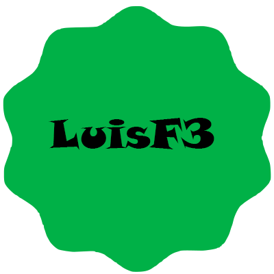

# LuisF3

## DeveloperLuisF3 App: Desarrollo con HTML, CSS, Javascript, Reactjs, MaterialUI, Nextjs, NodeJs, Firebase y Vercel.

### Contenido:

1. [Introducción](https://github.com/DeveloperLuisF3/LuisF3/blob/main/introduccion.md "I a introducción")
    * Introducción
    * Consideraciones iniciales
    * Dependencias
        * Frontend
        * Backend
2. [Frontend](https://github.com/DeveloperLuisF3/LuisF3/tree/main/frontend "Ir a frontend")
    * components
        * layout
            * layout.js
    * Pages
        * services.js
        * index.js
    * Public
        * images
3. Backend